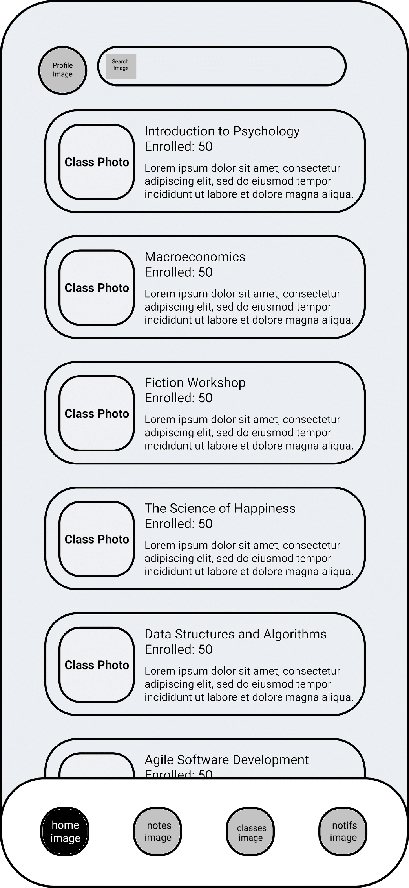
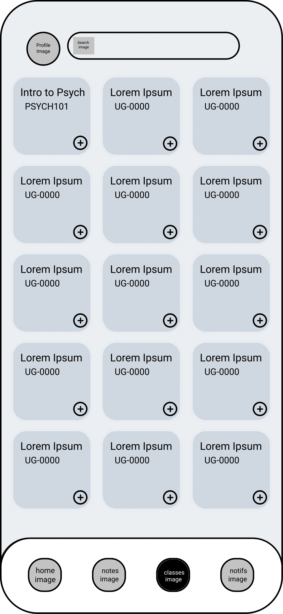
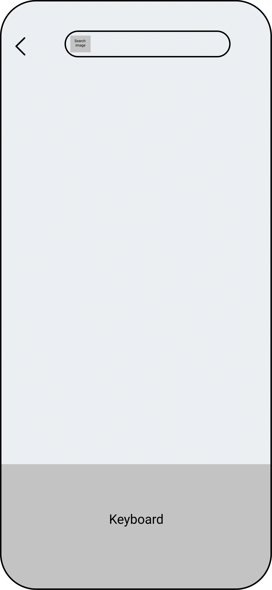
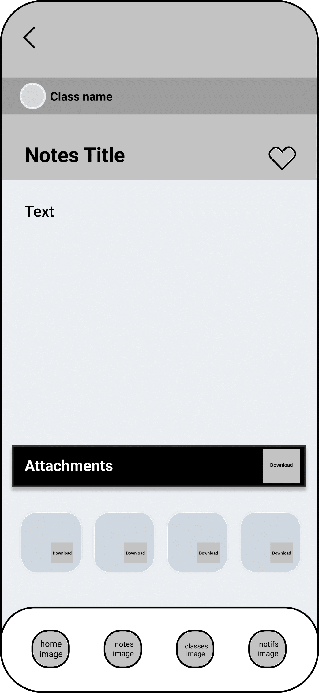
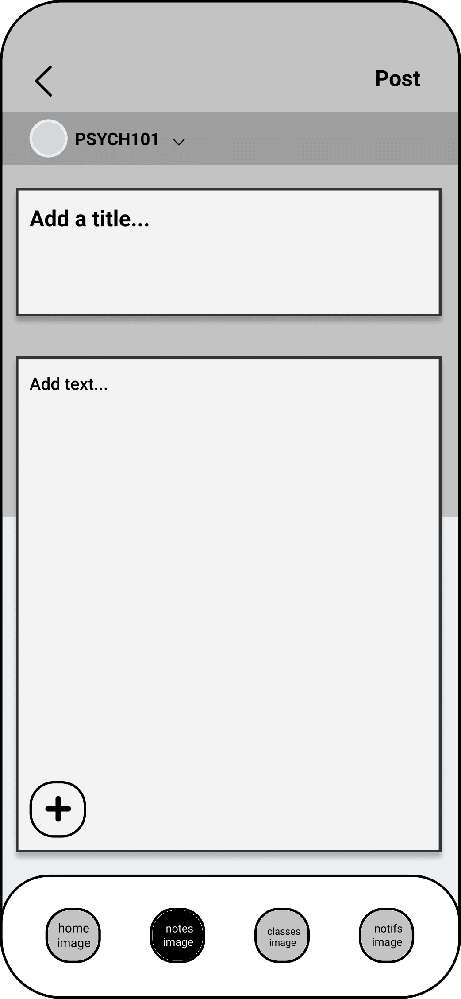
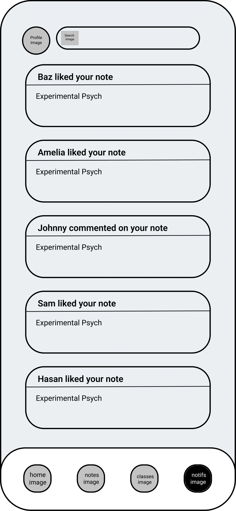

# User Experience Design

## Prototype

[Click here](https://www.figma.com/proto/VtGV21hUhiRFdOg1DgfULI/Wireframe?node-id=504%3A343&scaling=scale-down&page-id=480%3A341&starting-point-node-id=504%3A343) to view the hosted version of our prototype live on Figma.

## Wireframe
### Log In Page

When a user downloads and opens our app, they will be directed to this log in page. Log in will be accomplished using SSO through their respective school email, so the user only needs to provide their email. Once a user clicks the sign in button, they will be redirected to their school's respective SSO. Once they sign in through their school's SSO, the user will be redirected to the Notiefi home page.

### Home Page

When a user navigates to the home page, they will see all of the classes that they are "enrolled in" (i.e., the classes that they subscribe to from the app, which is different than the classes they are directly enrolled in through their school). Furthermore, a user can see their profile picture in the upper left hand corner, which links to their profile page, and the search bar, which they can click to search any class within their school that they want.

The bottom bar of the home page is the navigation menu. This menu will be present and consistent throughout most pages of the app. 

### Profile Page

When a user navigates to their profile page, they will see their profile picture, their name, the school they are enrolled in, and their bio. Furthermore, if they have posted notes, they will see the total upvotes/likes they've recieved since they've joined. The date they joined Notiefi will also be displayed.

Additionally, the user will have access to two tabs: the first, the notes that they've saved for easy access later; the second, all the notes that they have posted.

### Edit Profile Page

When a user navigates to their edit profile page, they will have the option to change their profile and background pictures, as well as their nickname and bio. If they are satisfied with their changes, they can click done. If they choose not to save their changes, they can click the back arrow. 

### Classes Page

When a user navigates to the classes page, they will see a screen of all the different classes offered at their school. If they want to "enroll" in a class, they can add that class to their home page. Just like the home page, a user will be able to search for any class at their school using the search bar at the top. 

### Search Page

When a user clicks the search bar, a separate page will pop up showing a keyboard and any relevant suggested searches based on what the user types. 

### Class Page

When the user navigates to an individual class, they will see the code and title of that class, how many students are enrolled/subscribed, and how many notes have been posted into that class. All the notes in each class will be organized by the number of upvotes each note recieves. For example, a note with more upvotes will be higher than a note with less upvotes. From the individual class page, a user can click on a specific note to navigate to that note's page. 

### Note Page

When a user navigates to a specific note, they will see the title of the note and any other associated text. The user will also see any attachments uploaded with the notes and have the ability to download attachments individually or all at once. If a user likes the note post, they can like/upvote it. Doing so will save the note to their profile. 

Additionally, a user will be able to scroll down and see any comments that were left on that posted note. 

### Add Note Page

When a user wants to add a note, they can navigate to the navigation bar and click the add notes button. Once they are on the page, they can select the class they want to add notes for, add a title and any associated text, as well as upload files, links, and/or images. If a user is satisfied with their post, they can post it using the post button in the upper right hand corner. If a user does not want to post, they can just hit the back button. 

### Notifications Page

When a user navigates to their notifications page from the navigation menu, they will see if anyone has liked or commented on any of their posted notes. 

